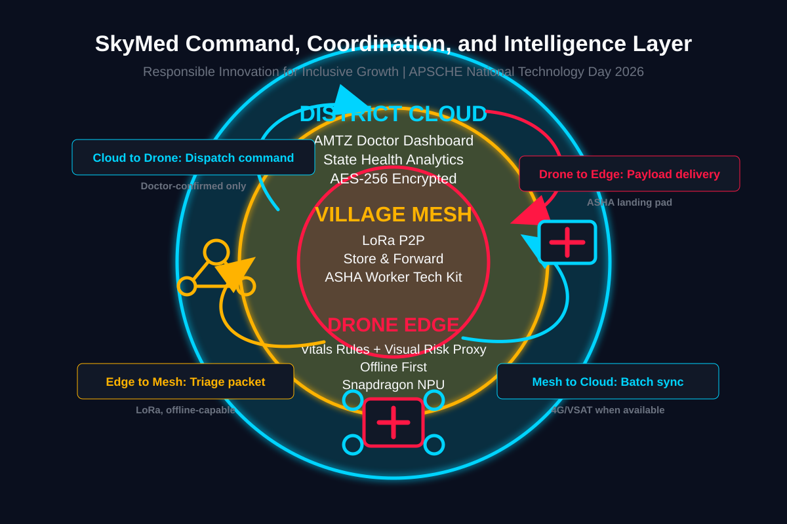

<div align="center">

<br/>

<picture>
  <source media="(prefers-color-scheme: dark)" srcset="https://img.shields.io/badge/%F0%9F%9A%81_SKYMED-0a0f1e?style=for-the-badge&labelColor=0a0f1e&color=00d4ff"/>
  
</picture>

# SkyMed

### **The Last Mile is the Hardest Mile.**
*We built the software that crosses it.*

<br/>

[](https://frontend-chi-green-80.vercel.app)
[](https://skymed-backend-production.up.railway.app/docs)

<br/>

[](https://fastapi.tiangolo.com)
[](https://react.dev)
[](https://sqlite.org)
[](https://leafletjs.com)
[](https://docker.com)
[](LICENSE)

</div>

---

## The Problem

A tribal mother in Paderu, Alluri Sitarama Raju district, goes into labour at 2 AM.

The nearest doctor is **47 kilometres away**. The road washed out in the monsoon. The PHC has no anaesthetist. Her ASHA worker — the one trained, trusted health link in this village — has no way to reach anyone faster than a four-hour jeep ride on a dirt track.

This is not a hypothetical. It is **Tuesday night** in tribal Andhra Pradesh.

| Crisis Indicator | Value | Source |
|:---|:---|:---|
| Doctor-to-population ratio | **1 : 10,000+** | Schedule V tribal areas |
| Reliable 4G coverage | **< 23%** | DoT Digital Bharat Nidhi gap reports |
| Maternal mortality vs state avg | **2.3× higher** | Tribal district baseline |
| Emergency response time | **4–6 hours** | NHM district reports |

> **The golden hour does not wait for bad roads.**

---

## What SkyMed Is

SkyMed is the **command, coordination, and intelligence software layer** for a VTOL medical drone network serving tribal Andhra Pradesh.

It is **not** a diagnostic tool. It is **not** a hardware project. It is **not** a kiosk in a forest.

It does **one thing precisely**: ensures the right medicine reaches the right ASHA worker — within the golden hour — through software that works offline, respects medical ethics, and trusts the humans already in the field.

```
ASHA captures vitals → Tablet scores triage locally (offline) →
LoRa mesh relays alert → Doctor reviews + confirms →
Drone dispatches to landing pad → ASHA carries last mile →
Patient receives care within golden hour
```

---

## Architecture — Three Rings

<div align="center">

<a href="docs/architecture.svg">
  
</a>

<sub><i>Click to view full resolution</i></sub>

</div>

<br/>

> **Why three rings?** Because the internet disappears in a valley. The ring closest to the patient must never need it.

### 🔴 Layer 1 — Drone Edge (Rugged Tablet)

The ASHA worker's tablet runs a vitals-first triage scoring engine **entirely offline**. Bluetooth peripherals (pulse oximeter, BP cuff, thermometer) feed directly into the rules engine. The Telugu-language, voice-guided interface requires no training beyond what ASHAs already know. If `triage_mobilenet_v3_int8.onnx` is present, the visual input path upgrades to a quantized edge model. Until pilot data validates a clinical model, the demo runs a transparent visual-risk proxy — and says so openly.

### 🟡 Layer 2 — Village Mesh (LoRa Gateway)

When the tablet scores a P1, a compact structured packet — no patient PII — is broadcast over LoRa mesh to the nearest SkyMed base node. Store-and-forward means **no case is ever lost** when connectivity is intermittent. The node batches packets for the district hub when any uplink (4G, VSAT, or opportunistic WiFi) becomes available.

### 🔵 Layer 3 — District Cloud (AMTZ Dashboard)

A doctor at the district hub receives the telemetry packet via WebSocket. They review vitals, call the ASHA worker directly, and — only after explicit confirmation — trigger a drone dispatch. **No autonomous dispatch. Ever.** The human is always the final authority.

---

## Quick Start

### One Command

```bash
git clone https://github.com/vivekyarra/skymed.git
cd skymed
docker-compose up --build
```

| Service | URL |
|:---|:---|
| Dashboard | [`localhost:5173`](http://localhost:5173) |
| API Docs (Swagger) | [`localhost:8000/docs`](http://localhost:8000/docs) |
| Health Check | [`localhost:8000/api/health`](http://localhost:8000/api/health) |
| Model Status | [`localhost:8000/api/model/status`](http://localhost:8000/api/model/status) |

### Manual Setup

<details>
<summary><strong>Backend</strong></summary>

```bash
cd backend
python -m venv .venv
source .venv/bin/activate          # Windows: .venv\Scripts\activate
pip install -r requirements.txt
uvicorn main:app --reload --port 8000
```

</details>

<details>
<summary><strong>Frontend</strong></summary>

```bash
cd frontend
npm install
npm run dev
```

</details>

---

## API Reference

| Method | Route | Description |
|:---|:---|:---|
| `POST` | `/api/triage` | Vitals + image → P1 / P2 / P3 score + suggested payload |
| `POST` | `/api/drone/dispatch` | Doctor-confirmed dispatch only; weight + wind validated |
| `GET` | `/api/drone/telemetry/{mission_id}` | Live drone position, battery, ETA, status |
| `GET` | `/api/cases` | Last 50 cases; filter by priority, status, village |
| `GET` | `/api/mesh/nodes` | 13 tribal AP mesh nodes with connectivity telemetry |
| `POST` | `/api/mesh/inject` | Inject a packet; trace its route across the mesh |
| `POST` | `/api/sync` | Simulate edge-to-cloud store-and-forward flush |
| `WS` | `/ws/live` | Live broadcast: missions, P1 alerts, mesh summary |

> Full interactive Swagger docs available at **`/docs`** when the backend is running.

---

## Demo Walkthrough — For Judges

> **Pre-requisite:** Run `docker-compose up --build` first. The database seeds **30 realistic cases** on startup.

<table>
<tr><td width="40"><strong>1</strong></td><td>

**Command Center** — Open [`localhost:5173`](http://localhost:5173). Tribal AP centered on a Leaflet dark-tile map. Pulsing cyan mesh nodes. P1 alert feed on the right. Drone telemetry strip at the bottom. Everything is live via WebSocket.

</td></tr>
<tr><td><strong>2</strong></td><td>

**Edge Tablet (ASHA Interface)** — Click **Edge Tablet** in the sidebar. Telugu UI, large single-action buttons, Bluetooth vitals capture. Click **Scan Vitals** — watch the Bluetooth animation and auto-populated critical values appear in 1.5 seconds.

</td></tr>
<tr><td><strong>3</strong></td><td>

**Submit a P1 Case** — Open **Triage Portal**. Upload any photo. Enter vitals: SpO₂ `88`, HR `132`, Temp `103.8`, BP `84`, Complaint `Snakebite`. Click **Analyze & Triage**. Watch the RadialBar gauge animate to a P1 score. Flagged vitals appear in red. Suggested payload auto-populates.

</td></tr>
<tr><td><strong>4</strong></td><td>

**Doctor Confirmation + Dispatch** — Toggle **Doctor Confirmed** → ON. Click **Dispatch Drone**. In the modal, select payload items — weight bar turns amber near 1.2 kg, red at 1.5 kg. Confirm. Mission ID appears.

</td></tr>
<tr><td><strong>5</strong></td><td>

**Live Drone Tracking** — Open **Drone Fleet**. Watch the mission stepper: Dispatched → En Route → Approaching → Landing → Returning. The drone marker on the Dashboard map moves in real time.

</td></tr>
<tr><td><strong>6</strong></td><td>

**Offline Mode** — Toggle **Offline Mode** in the top bar. Submit another triage case. The UI switches to **Local Edge Mode**. Sync queue badge shows `1 Pending`. Toggle back online — watch the animated three-stage flush: ASHA Tablet → Village Mesh → District Cloud.

</td></tr>
<tr><td><strong>7</strong></td><td>

**Mesh Network** — Open **Mesh Network**. See the 13 tribal AP nodes, LoRa connectivity status, last sync times, and data flow animation. Click **Simulate Sync** for the animated batch flush.

</td></tr>
</table>

---

## What We Don't Claim — And Why That Matters

Responsible innovation means knowing where to stop.

| What SkyMed does **NOT** do | Why we are explicit about it |
|:---|:---|
| Autonomous diagnosis | AI assigns urgency priority only. NMC telemedicine guidelines require a registered practitioner for all clinical decisions. |
| Transport infectious biological samples | TB cultures and biopsies require biohazard protocols; a drone crash would be a public health incident. |
| BVLOS operations in Phase 1 | Phase 1 is VLOS (< 450 m, DGCA compliant). BVLOS is Phase 2 after exemption. |
| Quantum encryption | AES-256 + DPDP Act 2023 aligned. QKD requires hardware that cannot run on a LoRa node. |
| Cold-chain payloads in Phase 1 | Antivenom requires refrigeration. Phase 1 carries heat-stable items only. Phase 2 adds an insulated pod. |

---

## Payload Constraints

| Item | Weight |
|:---|---:|
| EpiPen 2-pack | 0.18 kg |
| ORS Sachets ×10 | 0.25 kg |
| Wound Dressing Kit | 0.35 kg |
| Rapid Malaria / Dengue Test Kit | 0.12 kg |
| Glucagon Emergency Kit | 0.22 kg |
| Blood Glucose Strips Kit | 0.08 kg |
| **Maximum per mission** | **1.50 kg** |

> Dispatch is automatically rejected if payload exceeds **1.5 kg** or wind speed exceeds **8 m/s**.

---

## Impact Model

| Input | Value | Source |
|:---|:---|:---|
| Tribal habitations in scope | 847 | Paderu ITDA jurisdiction |
| High-risk health events / hamlet / month | ~12 | NHM tribal district baseline |
| P1 access-gap proxy | 28.3% | Conservative estimate (NFHS-5) |
| **Potential P1 review opportunities / month** | **~2,874** | 847 × 12 × 28.3% |

> *"This is a proxy pending pilot data. We have been deliberately conservative."*

### Cost-per-Intervention Comparison

| Pathway | Approx. Cost | Outcome |
|:---|---:|:---|
| SkyMed-coordinated dispatch | ₹180 | Doctor-reviewed medicine at ASHA landing pad |
| Current delayed pathway | ₹0 | Patient may miss the golden hour |
| Private ambulance | ₹4,500+ | Often unavailable; blocked by road access |

---

## Roadmap

| Phase | Timeline | Milestone |
|:---|:---|:---|
| **Phase 1** | 0–3 months | Software simulation · AMTZ MoU discussion · Safety protocol documentation |
| **Phase 2** | 3–9 months | VLOS pilot: Paderu block, 3 villages, 3 drones · Cold-chain pod development |
| **Phase 3** | 9–18 months | DGCA BVLOS exemption application · 13-district rollout plan |
| **Phase 4** | 18–36 months | NHA partnership · National replication model |

---

## Technology Stack

| Layer | Stack |
|:---|:---|
| **Backend** | FastAPI · SQLModel · SQLite · WebSocket · Pillow |
| **Triage Engine** | Weighted vitals rules · Transparent visual-risk proxy · Optional ONNX hook |
| **Frontend** | React 18 · TypeScript · Vite · Tailwind CSS |
| **Maps** | Leaflet · react-leaflet · CartoDB dark tiles |
| **Charts** | Recharts (AreaChart · RadialBar · PieChart · BarChart) |
| **Animation** | Framer Motion |
| **Realtime** | Native WebSocket |
| **Infrastructure** | Docker Compose · Railway (backend) · Vercel (frontend) |

---

## APSCHE Thematic Alignment

| Theme | SkyMed Alignment |
|:---|:---|
| ✅ AI & Electronics | Edge triage priority scoring with transparent visual-risk proxy |
| ✅ Space Technology & Drones | VTOL dispatch and coordination software layer |
| ✅ Medicine, Biotechnology & Allied Life Sciences | ASHA-integrated care relay · Doctor-confirmed dispatch · NMC compliant |

Three themes. Claimed honestly. Defended with specifics.

---

## Project Structure

```
skymed/
├── backend/
│   ├── main.py              # FastAPI application + WebSocket endpoints
│   ├── triage_engine.py     # Vitals-based triage scoring rules engine
│   ├── triage_model.py      # Visual-risk proxy + optional ONNX model loader
│   ├── drone_simulator.py   # Waypoint interpolation, wind validation, battery
│   ├── mesh_engine.py       # LoRa mesh store-and-forward simulation
│   ├── models.py            # SQLModel schema definitions
│   ├── seed_data.py         # 30-case realistic data seeder
│   └── Dockerfile
├── frontend/
│   └── src/
│       ├── pages/
│       │   ├── Dashboard.tsx     # Command Center with live map + telemetry
│       │   ├── TriagePortal.tsx   # Vitals + image → P1/P2/P3 scoring
│       │   ├── EdgeTablet.tsx     # ASHA worker Telugu interface
│       │   ├── DroneFleet.tsx     # Mission tracking + stepper
│       │   ├── MeshNetwork.tsx    # 13-node tribal AP mesh visualization
│       │   ├── Analytics.tsx      # District health analytics
│       │   └── About.tsx          # Project context + architecture
│       ├── App.tsx               # Router + layout + offline mode
│       └── main.tsx
├── docs/
│   ├── architecture.svg         # Three-ring architecture diagram
│   └── use_case_document.md     # Full 5-page use case document
├── docker-compose.yml
└── README.md
```

---

## Built For

<div align="center">

**APSCHE National Technology Day 2026**
*Responsible Innovation for Inclusive Growth*
**Amaravati Vigyan Puraskar**

Submitted by **Vivek Yarra**
III Year B.Tech CSE · Vignan's LARA Institute of Technology & Science, Guntur

---

*"SkyMed does not replace the doctor.*
*It ensures the doctor sees the right patient first —*
*before the patient runs out of time."*

<br/>

[](https://frontend-chi-green-80.vercel.app)
&nbsp;&nbsp;
[](https://skymed-backend-production.up.railway.app/docs)
&nbsp;&nbsp;
[](docs/use_case_document.md)
&nbsp;&nbsp;
[](docs/architecture.svg)

<br/>

**MIT License** · Built with purpose for tribal Andhra Pradesh

</div>